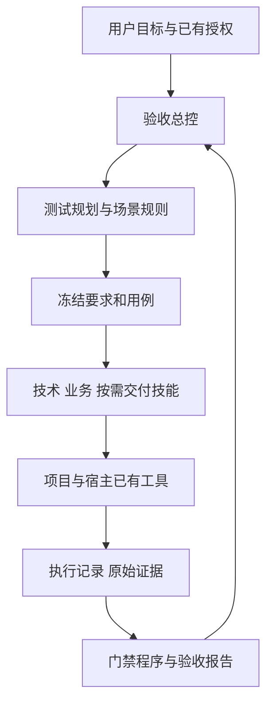

# 架构与实施边界

## 目标

把已确认要求与真实执行证据关联。日常本地测试优先复用，第三方先只读预检，目标交付按承诺增加演练。测试投入受到时间、尝试和已声明外部费用约束。

## 依赖方向

规划拥有标准与范围；执行产生事实；报告解释事实。技能不直接改门禁统计。七个技能默认由一个 Agent 按需加载，MCP 和多 Agent 不作为基础依赖。

## 程序模块

| 文件 | 责任 |
|---|---|
| qa.py | 命令入口、输出与退出码 |
| qa_store.py | 原子 JSON、项目发现、有限快照、文件摘要 |
| qa_contracts.py | 方案结构、要求关系、依赖图及预算校验 |
| qa_acceptance.py | 三类验收合同、任务/状态覆盖推导、观察结构及基线前置 |
| qa_adapters.py | 结构化框架结果及零用例/跳过/不稳定解析 |
| qa_runtime.py | 冻结方案、预算、串行执行、重试、原生观察取证 |
| qa_report.py | 证据/版本检查、要求覆盖、六维结果与报告 |
| demo.py | 隔离项目的实际缺陷发现与新版本复测演示 |

## 对象与状态

plan.json 由代理根据事实编制；首次 run/check/record 冻结。每 case 对应 requirement_ids 和一个执行器，支持前置依赖。session 保存所有 attempts 和预算记录。状态 passed/failed/blocked/skipped/not_run/flaky；范围外单列。

snapshot 与 environment_hash 绑定版本。文件变更、证据缺失或摘要异常导致当前结论证据不足；历史真实失败仍保留。失败后同版本重试成功记不稳定。修复或更换标准/环境新建轮次。

## 自动化与观察

命令参数直接传进程，没有 shell 拼接；任意项目命令仍可能有副作用，代理负责检查并遵守宿主授权。结构化输出只能写独立 evidence_dir。

浏览器/computer use 是宿主能力。操作前 check 预算与前置，事后 record 保存断言与真实文件。程序不通过文件存在证明图像/业务语义，也无法强制限流宿主工具或计量宿主模型费用。

schema 1.1 的 check 为观察发放单次记录，绑定方案、环境、快照和尝试；record 留存逐点断言与原始文件关系，未满足条件的事后观察保留投入但不能通过。report 再核验原记录。所有状态写入本地 JSON，换 Agent/进程不丢协议状态。

readiness 自动推导必要覆盖；required/out-of-scope 声明不能替代这层覆盖。六维质量指标继续存在，三类验收与其正交。产品门禁由 gate 默认检查 product_accepted；focused 和旧档案不能获得整体放行。宿主必须实际采用这个返回值，插件不能拦截宿主绕过门禁的独立动作。

## 第一版边界

预算上界、执行累计、重试数及证据一致性由程序约束；业务理解、用例设计、模型路由、变更影响和观察语义由技能指导。历史引用人工核验，不自动跨轮放行。当前结果不是全模型、全宿主、全技术栈支持证明。
